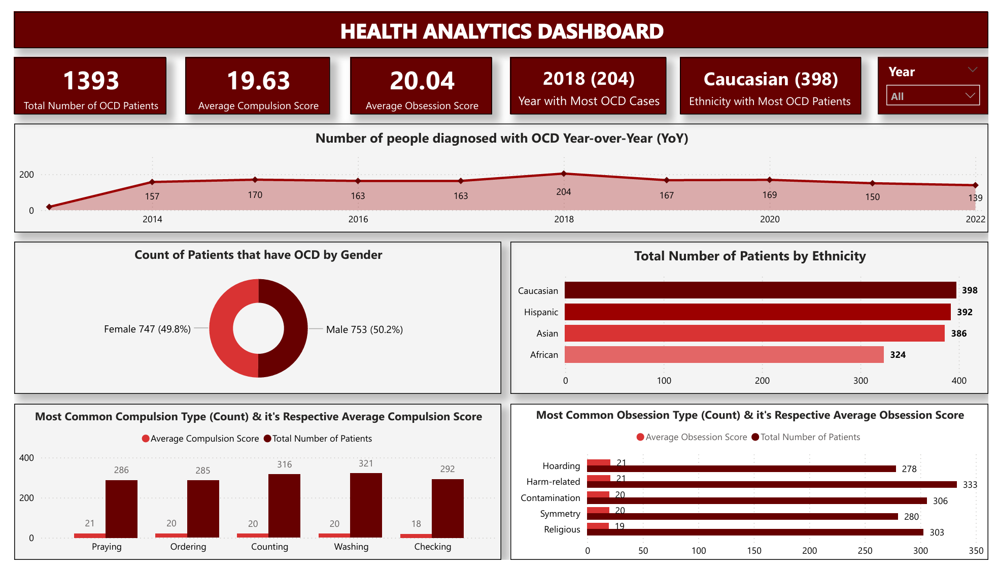

# OCD Patients Report

In this project, we will be working with various data analysis tools, including SQL, Power BI, and Excel, to derive insights from the data. SQL will help us manipulate the data and perform some feature engineering. Excel and Power BI will assist us in visualizing our findings in a way that is easy for stakeholders to consume. 

**1. Data Exploration and Insight Generation (SQL):**

- **SQL Queries:** I utilized SQL queries to analyze the OCD patient dataset. This allowed me to identify relevant trends and correlations within the data.
- **Actionable Insights:** By analyzing the queried data, I derived actionable insights to discover key findings contained in the dataset.
- **Data Export (CSV):** For initial exploration and potential data manipulation in Excel, the generated insights were exported in a CSV format.

**2. Data Visualization and Dashboard Creation with Power BI:**

- **Data Import:** The CSV file containing the insights was then imported into Power BI.
- **Data Visualization:** Power BI's functionalities were used to create clear and informative visualizations that effectively communicated the OCD patient data insights.
- **Dashboard Development:** I concluded the project with the creation of a comprehensive Power BI dashboard. This dashboard served as a centralized platform for exploring and analyzing the key OCD patient metrics.